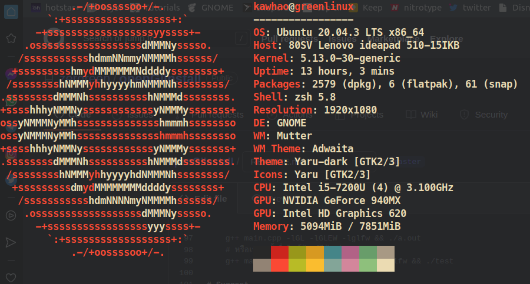
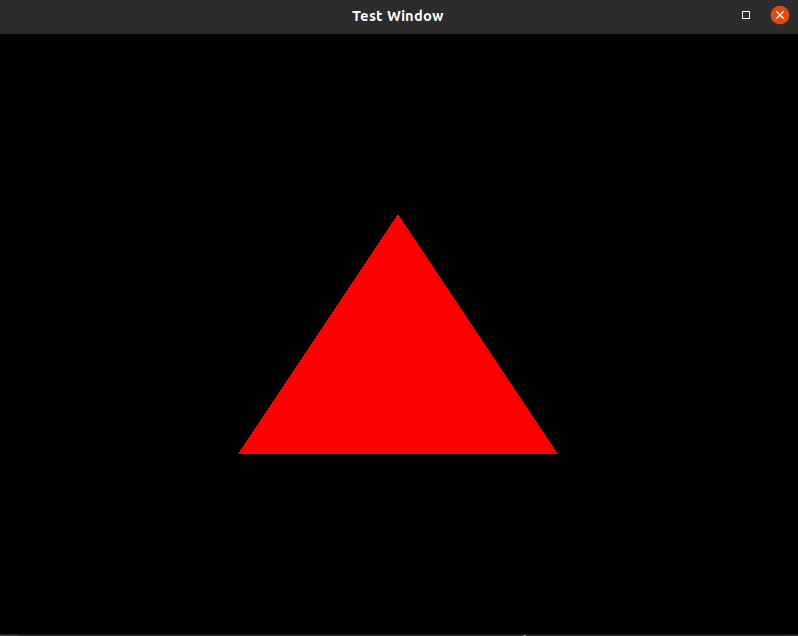

# openGlInstall

การติดตั้ง openGL บน linux (Ubuntu) [ใน 5 นาที(มั้ง)]  
เราเทสบน เครื่อง linux จริง ไม่ได้ทำผ่าน virtual machine (VM Ware) หรือ WSL (linux terminal เทียม) น๊ะจ๊ะ  
### แต่เพื่อนก็แวะมาดู syntax ของ compiler g++ ได้นะะ เช่น -L -l g++ เป็นต้น

# How To install 

    # Update central repository library/(อัพเดต สโตร์กลาง)
    sudo apt-get update
    
    # Program && librarry /(ตัวโปรแกรมและไลบารี่ที่จำเป็นสำหรับ openGL)
    sudo apt-get install freeglut3
    sudo apt-get install freeglut3-dev
    sudo apt-get install binutils-gold
    sudo apt-get install g++ 
    sudo apt-get install cmake
    sudo apt-get install libglew-dev
    sudo apt-get install mesa-common-dev
    sudo apt-get install mesa-utils
    sudo apt-get install build-essential
    sudo apt-get install libglew1.5-dev libglm-dev

    
# Check version && Test OpenGL

หลังจากที่เราติดตั้งซอฟต์แวร์ช้างต้นแล้ว ให้เราเช็ค เวอร์ชั่นของ openGl โดยใช้คำสั่ง 
   
    glxinfo | grep "OpenGL version"
    
 เทสว่า เครื่องเราลองรับ opengl หรือไม่ โดยใช้คำสั่ง (โดยจะปรากฏเป็น simulation วัตถุเกียร์)
 
    glxgears
    
# Compile And Run code

การรันไฟล์ .cpp เราต้องนำเข้าไลบารี่ที่ เราได้ระบุไว้ในส่วนของ include ซึ่ง ณ ที่นี้ ได้แก่ Gl, GLEW, glfw  
   ซึ่งเราจะ นำเข้าไลบารี่ มาคอมไพล์ด้วยวิธีดังนี้ (อัพไฟล์ main.cpp ให้แล้วนะ) 

    g++ main.cpp -lGL -lGLEW -lglfw
    
รูปแบบ syntax -l คือ

    # -l => มาจากคำว่า library ส่วนที่ตามหลังคือ ไลบารี่นั้น โดยเราสามารรันแบนี้ก็ได้
    # -lGl หรือ -l Gl
    
โดยหลังจากที่เราคอมไพล์ไฟล์แล้วเราจะได้ไฟล์เบื้องต้นมาชื่อว่า a.out โดยการรันไฟล์นี้ จะเหมือนกับใน gcc คือ

    ./a.out
    
# VS CODE COMGILE & RUN & DEBUG

หากเพื่อนอยากจะรันแบบไม่ต้องดีบัก สามารถ ก็อปไฟล์นี่ไปใช้ [.vscode](https://github.com/zergreen/openGlInstall/tree/master/.vscode)
เรามาเข้ากันก่อนว่า task.json คืออะไร??
task.json คือ ไฟล์ที่เอาไว้ใส่ค่าการคอมไพล์ โดยเรามาดูที่ตัวแปร args ใน [task.json](https://github.com/zergreen/openGlInstall/blob/master/.vscode/tasks.json) กันดีกว่าา...
    
     "args": [
                "-fdiagnostics-color=always",
                "-g",                   // ใช้เวลาที่เราต้องการจะสั่งให้คอมไพล์เลอร์ ไปคอมไพล์ที่ไฟล์ไหนบ้าง
                "Libs/*.cpp",           // เป็นการบอกว่า เราจะเอา dircetory(โฟลเดอร์) ที่ชื่อ Libs มาคอมไพล์ด้วยนะ
                "-g",
                "${fileDirname}/*.cpp", // คอมไพล์ไฟล์ในไดเรคทอรี่ร์ปัจจุบันที่เราอยู่ โดยคอมไพล์ เฉพาะไฟล์ที่เป็นนามสกุล .cpp ในไดเรคทอรี่ นี้
                "-l", "GL",             // ในเข้าไลบารี่ที่ชื่อ GL มาคอมไพล์ด้วย [ -l (library) ]
                "-l", "GLEW",
                "-l", "glfw",
                "-o",                   // จะเอาไฟล์ชื่ออะไร [ -o (output) ]             
                "${fileDirname}/${fileBasenameNoExtension}" // ชื่อไฟล์ ตามชื่อที่เซฟไว้
            ],
            
โดยเราสามารถแปลง args เป็นคำสั่งใน terminal ได้แบบด้านล่างนี้

    g++ -g Libs/*.cpp -g *.cpp -l GL -l GLEW -l glfw -o test
    
# Link Library

ในภาษาโปรแกรมมิ่ง นั้นมี ไลบารี่ให้เราใช้ ซึ่งบางครั้งเราก็บอกชื่อ ไลบารี่ไปแล้วด้วย -l แต่ คอมไพลเลอร์ดันจ๊าดง๊าว ไม่รู้ว่า ไลบารี่เราเก็บไว้ที่ไหนซ่ะงั้น  
เช่นนั้นแล้ว เราก็บอก absolute path (ที่อยู่ที่แน่นอน) ให้มันรู้กันไปเล้ยยย....
Syntax

    -Lพาธที่เก็บไลบารี่ไว้ -lชื่อไลบารี่ที่จะใช้        # -L => Links , -l => library
ตัวอย่าง

    gcc main.cpp -L/usr/include/GL -lGL
    
# Update Lab7 (OpenGLFirstProject)

ในแลปที่เจ็ด เราจะต้อง นำโฟลเดอร์ Libs เข้ามาคอมไพล์ดัวยนะ โดยใช้คำสั่งด้านล่างนี้ (ไฟล์ [OpenGLFirstProject](https://github.com/zergreen/openGlInstall/tree/master/OpenGLFirstProject))

    g++ Libs/*.cpp -g main.cpp -lGL -lGLEW -glfw
    
# Trick

เราสามารถรวบทั้งการคอมไพล์และรันมาไว้ในบรรทัดเดียวกันได้ดังนี้

    g++ main.cpp -lGL -lGLEW -lglfw && ./a.out
    # หรือเราจะตั้งชื่อไฟล์ด้วยก็ได้ เช่น
    g++ main.cpp -o test -lGL -lGLEW -lglfw && ./test

# Suggest

ถ้าคอมไพล์ไม่ผ่านทั้งที่โค้ดถูกแล้วแสดงว่าอาจจะไม่ได้นำเข้าไลบารี่เข้ามาคอมไพล์ด้วย แนะนำว่าให้เซิชใน  
StackOverFlow แล้ว ติดตั้งไลบารี่นั้นซ่ะ แล้วตอนคอมไพล์ก็แนบไลบารี่นั้นด้วย

# Test On

# Complete Photo

เมื่อคุณคอมไพล์และรันสำเร็จจะได้รูปภาพประมาณนี้นะ

# Referrence

https://www.wikihow.com/Install-Mesa-(OpenGL)-on-Linux-Mint (Suggest)  
http://www.codebind.com/linux-tutorials/install-opengl-ubuntu-linux/

    

